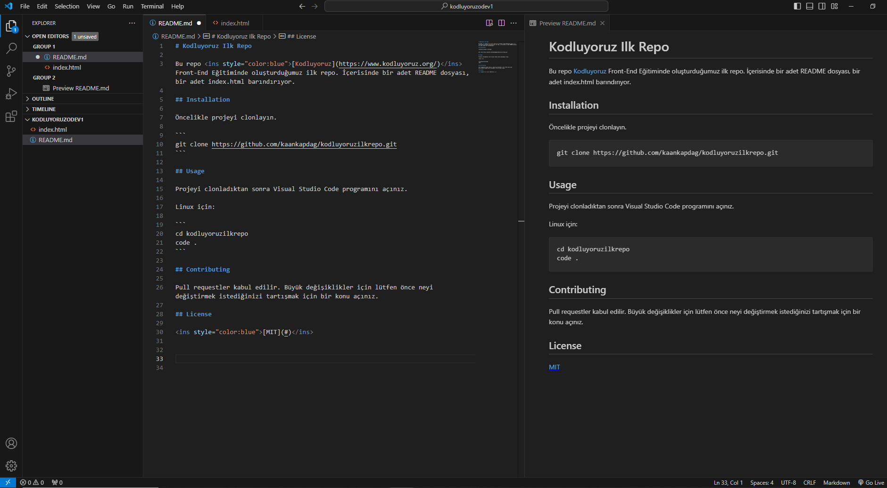

# Kodluyoruz Ilk Repo

Bu repo <ins style="color:blue">[Kodluyoruz](https://www.kodluyoruz.org/)</ins> Front-End Eğitiminde oluşturduğumuz ilk repo. İçerisinde bir adet README dosyası, bir adet index.html barındırıyor.

## Installation

Öncelikle projeyi clonlayın.

```
git clone https://github.com/kaankapdag/kodluyoruzilkrepo.git
```

## Usage

Projeyi clonladıktan sonra Visual Studio Code programını açınız.

Linux için:

```
cd kodluyoruzilkrepo
code .
```

## Contributing

Pull requestler kabul edilir. Büyük değişiklikler için lütfen önce neyi değiştirmek istediğinizi tartışmak için bir konu açınız.

## License

<ins style="color:blue">[MIT](#)</ins>


